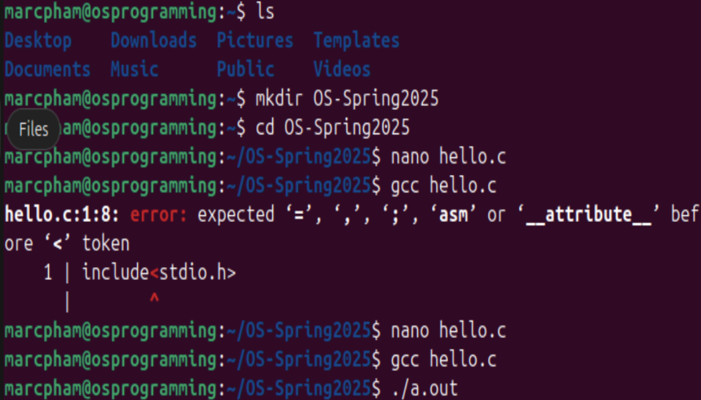

# Operating Systems: Programming 1
Name: Marc Pham

The snapshot (basic_linux_commands.png) shows that the basic linux commands worked on my system.

The next snapshot (hello_world_output.png) executes the hello.c file and shows the Hello World! output to the terminal.

